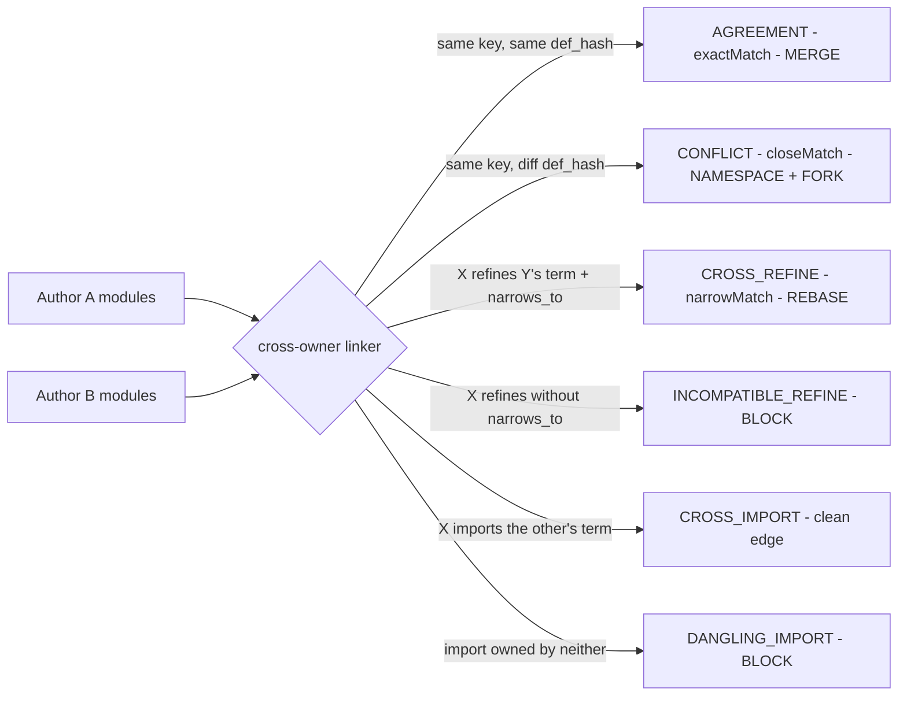

# Negotiation Protocol — the federated (multi-author) generalization of the linker

*Status: prototype, 2026-06-13. Companion to `SPINE_FIRST_DRAFTING_PROTOCOL.md`
(§"The per-paper metadata bundle") and the single-author linker
`build_ontology.py`. Tooling: `negotiate_modules.py`.
Fixture: `experiments/`.*

## Why this exists

The single-author linker (`build_ontology.py`) enforces **one owner per term**
and **aborts** on a collision: within one corpus, a term has exactly one
introducing module, and two modules claiming the same `term_key` is a bug. That
is correct when modules are *temporal slices of one author's program*, reconciled
by **rebase** — the regime the corpus actually runs in (see R14/2026u §"A
Realized Instance").

It is the wrong behavior **across authors**. When two independent authors each
legitimately introduce a term, the collision is not a bug to abort on — it is a
**negotiation to surface**. The strong claim of the realized system — that a
reader (or their tooling) can *negotiate a paper before reading its prose* — is
fully warranted only in this federated case. This protocol is that
generalization: it keeps the linker's machinery (the same module parser, the
same content-addressed `def_hash`) but replaces *abort-on-collision* with
*classify-and-propose-reconciliation*.



## The interaction classes

Given two authors' module sets, every cross-owner interaction falls into exactly
one class. The linker emits a `def_hash` per term (sha256 of the trimmed
definition); identity is content-addressed, so "same definition" is mechanical,
not a judgment call.

| Class | Trigger | Resolved? | SKOS predicate | Reconciliation operation |
|---|---|---|---|---|
| `AGREEMENT` | both own the key, identical `def_hash` | yes | `skos:exactMatch` | **MERGE** — assert exactMatch; either author may import the other's term unchanged |
| `CONFLICT` | both own the key, different `def_hash` | **no** | `skos:closeMatch` (same concept) / `skos:relatedMatch` (key collides on distinct concepts) | **NAMESPACE** the colliding keys (`authorA:term` vs `authorB:term`) + curate the mapping; **FORK** the loser's key if the concepts truly differ |
| `CROSS_REFINE` | author X refines a term author Y owns, with a `narrows_to` | yes | `skos:narrowMatch` | **REBASE** — X's refinement becomes a `narrows` edge onto Y's term |
| `INCOMPATIBLE_REFINE` | X refines Y's term with no `narrows_to` | **no** | — | **BLOCK** until X supplies an explicit narrowing |
| `CROSS_IMPORT` | X imports a term the other author owns | yes | `skos:exactMatch` | none — a clean cross-author dependency edge |
| `DANGLING_IMPORT` | X imports/refines a term **neither** author owns | **no** | — | **BLOCK** until some author owns the term or X drops the import |

The unresolved classes — `CONFLICT`, `INCOMPATIBLE_REFINE`, `DANGLING_IMPORT` —
are what `--gate` fails the build on (the federated CI semantics). The single
author's lock / fork / rebase / merge vocabulary
(`SPINE_FIRST_DRAFTING_PROTOCOL.md` §"Operations") is preserved and lifted to
operate *across owners* rather than across one author's timeline.

## Running it

```
uv run python negotiate_modules.py \
    --author-a experiments/authorA \
    --author-b experiments/authorB
```

Each `--author-*` is a directory of that author's module YAML files (any
`*.yaml`/`*.yml` with a `paper_key`), or a single module file. The directory
name is the author's **namespace** for qualifying colliding keys. The tool:

1. parses both authors' modules with the *same* parser the single-author linker
   uses (`build_ontology.Module` + `def_hash`), so the two linkers can never
   disagree on how a module is read;
2. classifies every cross-owner interaction (table above);
3. prints a report grouped by class, with the proposed reconciliation operation
   per finding;
4. `--sssom PATH` writes the proposed term↔term mappings as an **SSSOM** TSV
   (Matentzoglu et al. 2022) — `subject_id`, `predicate_id`, `object_id`,
   `mapping_justification` (`semapv:LexicalMatching` for mechanical hash/lexical
   matches, `semapv:ManualMappingCuration` for proposals a human must confirm),
   `confidence`, `comment`;
5. `--gate` exits nonzero when any interaction is unresolved.

Default behavior **reports** (exit 0) — surfacing incompatibilities is the
point; it never aborts the way the single-author linker does.

## The reconciliation procedure (worked, on the fixture)

The fixture (`experiments/`) is two authors — a
"spectral" author A and a "semiotic" author B — engineered to hit all four
interesting classes. The negotiation between them resolves as follows:

1. **`cohort` → AGREEMENT.** Both authors define it identically (same
   `def_hash`). Reconcile by **MERGE**: emit `authorA:cohort skos:exactMatch
   authorB:cohort` and let either author `import` the other's term. No prose
   changes.
2. **`perception-cloud` → CROSS_REFINE.** B refines A's term with an explicit
   `narrows_to` ("the subset measured for a single named cohort"). Reconcile by
   **REBASE**: B's term becomes a `narrows` of A's; emit `narrowMatch`. B keeps
   its narrower reading without claiming ownership.
3. **`brand-signal` → CONFLICT.** Both own the key with incompatible definitions
   (A: an 8-dimension composite ray; B: any marketing communication). Reconcile
   by **NAMESPACE** (`authorA:brand-signal` vs `authorB:brand-signal`) and a
   **curated mapping**: because the label is shared but the definition diverges,
   the proposal is `skos:closeMatch` at confidence 0.5, flagged
   `semapv:ManualMappingCuration` — the authors confirm whether it is a genuine
   close match or a key collision on distinct concepts (in which case one
   **FORKs** to a new key, e.g. `brand-broadcast`).
4. **`brand-equity` → DANGLING_IMPORT.** B imports a term neither author owns.
   **BLOCK**: either author must introduce and own `brand-equity`, or B drops the
   import. Until then the federation is not clean.

The SSSOM TSV from step 4 of "Running it" is the machine-readable reconciliation
artifact: the agreed mappings (`exactMatch`/`narrowMatch` at high confidence) can
be ingested directly; the curated proposals (`closeMatch` at 0.5) carry the
manual-curation justification that records *that a human decision is still owed*.

## Relationship to the single-author system

This is a strict generalization, not a replacement:

- **One author** → run `build_ontology.py`. A collision is a bug; abort. Modules
  are temporal slices; reconcile by rebase. (The corpus runs here today.)
- **Two+ authors** → run `negotiate_modules.py`. A collision is a negotiation;
  report and propose. Modules are owned by distinct authorities; reconcile by
  namespacing + curated SSSOM mappings + the lifted lock/fork/rebase/merge ops.

The single-author linker is the special case where the two authors are the same
person at two points in time — and the "negotiation" collapses to a rebase the
author performs against their own past self. The federated case is the evidence
that turns the "negotiate a paper before you read it" thesis (R14/2026u
§"A Realized Instance") from a single-author existence proof into a multi-author
practice. Building this prototype is the first step of that evidence; the
remaining step is exercising it on two *real* independent corpora.

## What this prototype does and does not settle

- **Does**: surface every cross-owner incompatibility mechanically, classify it,
  and propose a typed, justified reconciliation — before either author reads the
  other's prose. This is the federated link-time compatibility check.
- **Does not**: decide the semantic questions for the authors. `CONFLICT`
  mappings are proposals at 0.5 confidence flagged for manual curation; the tool
  refuses to assert `exactMatch` on a definitional mismatch. Nor does it yet
  write the reconciled state back into either author's modules — applying the
  MERGE/REBASE/NAMESPACE/FORK operations remains an authored edit, exactly as the
  single-author ops are.
